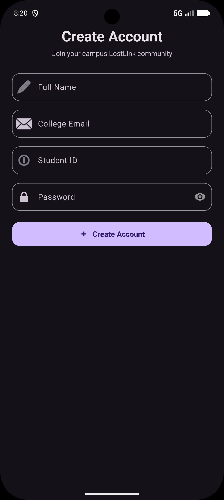
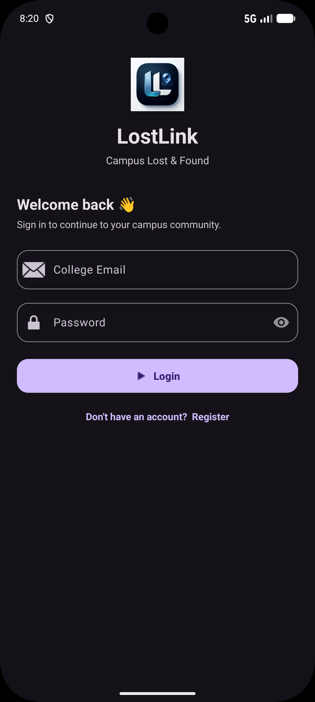
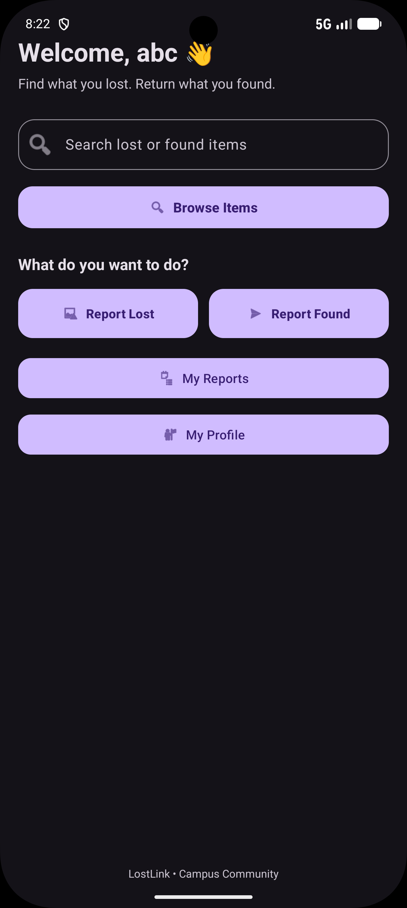
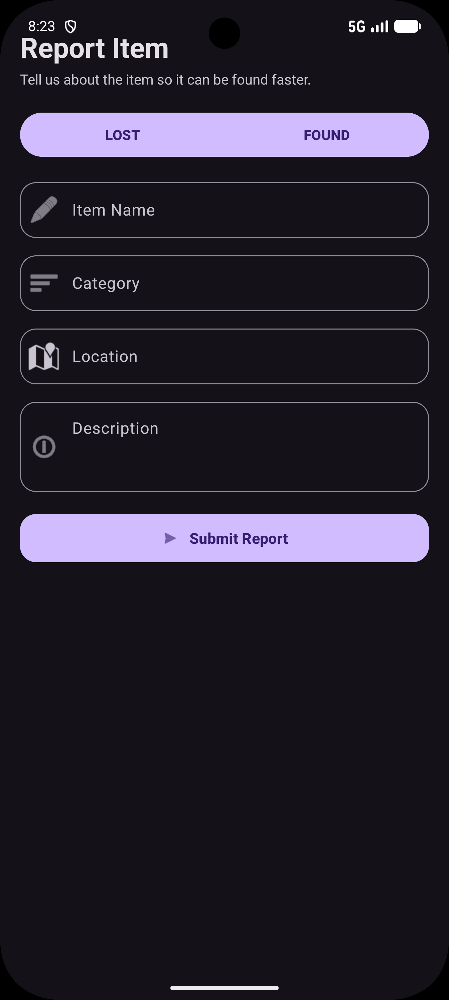
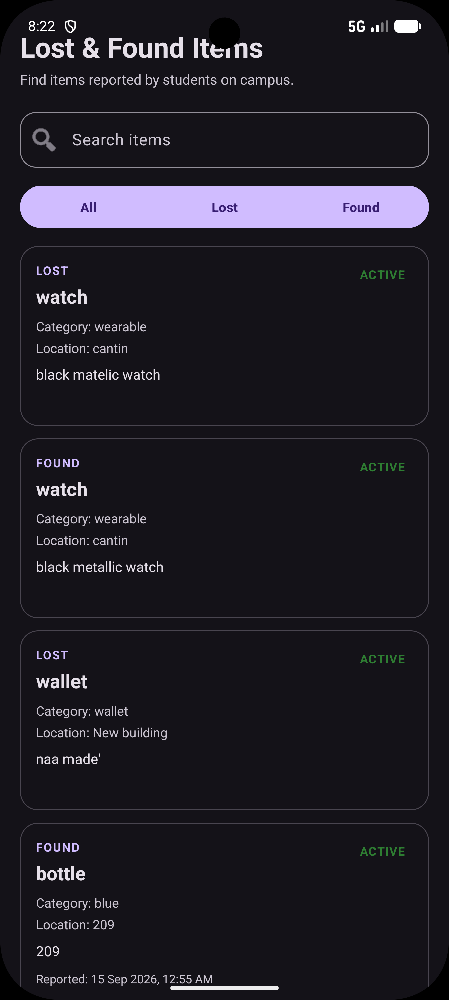
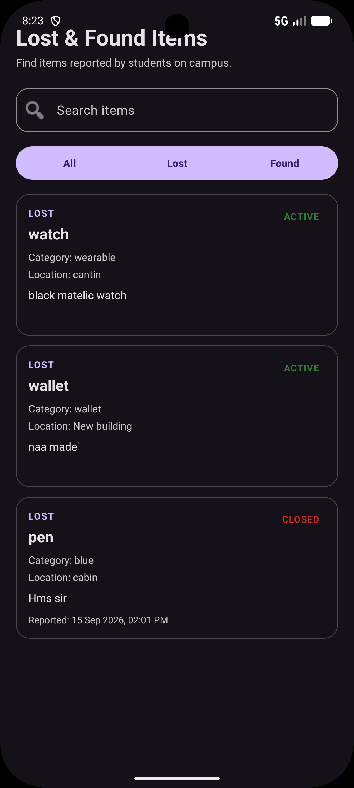
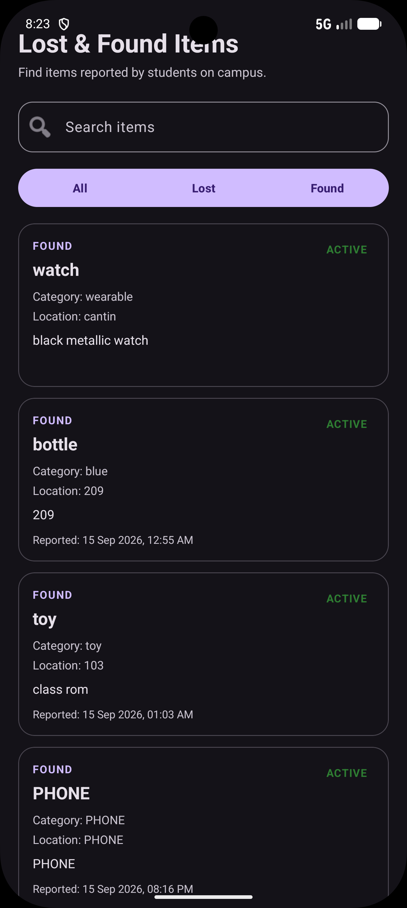
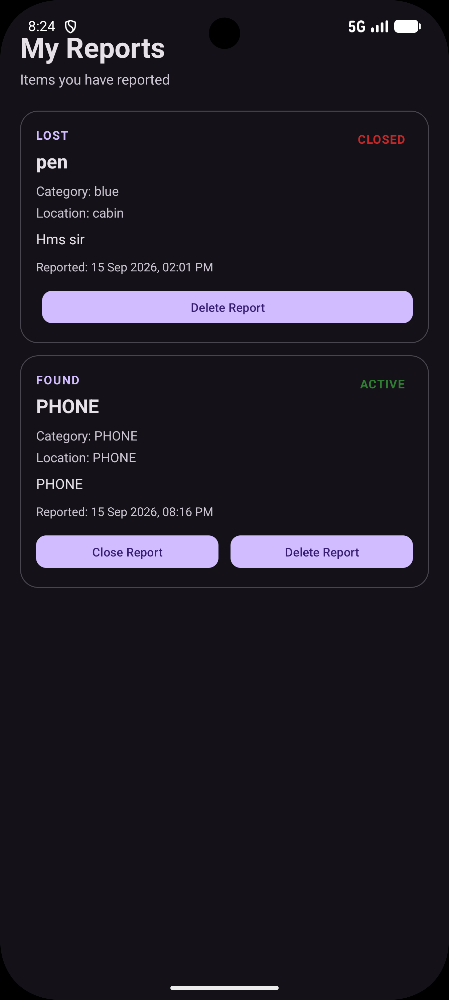
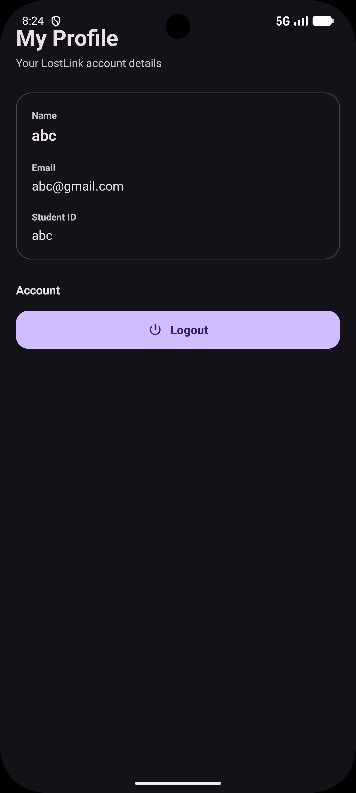

# LostLink: A Smart Lost & Found Platform for Campus Students

## AIM & Objective

To develop an Android application that helps college students report, browse, search, and manage lost and found items within their campus community.

The application provides a structured platform for students to report lost or found belongings and discover related reports easily.

---

# Project Overview

LostLink is an Android-based Lost & Found application developed for college students.

The application allows users to:

- Create a student account
- Login to the application
- Report lost items
- Report found items
- Browse all reported items
- Search for specific items
- Filter Lost and Found reports
- View their own reports
- Close active reports
- Delete their own reports
- View profile details
- Logout from the application

---

# Main Features

## 1. Account Management

- Student Registration
- Login Authentication
- Account-specific user information
- Profile Details
- Logout Functionality

## 2. Lost and Found Reporting

Users can report an item as:

- LOST
- FOUND

Each report contains:

- Reporter Email
- Item Name
- Category
- Location
- Description
- Date and Time
- Report Status

## 3. Browse Items

Users can:

- View all Lost and Found items
- Search for reported items
- View only Lost items
- View only Found items

## 4. My Reports

Users can manage the reports created by their own account.

Available actions:

- View personal reports
- Close active reports
- Delete reports
- Check report status

## 5. Report Status

| Status | Meaning |
|---|---|
| ACTIVE | The report is currently active |
| CLOSED | The report has been resolved or closed |

---

# Output Screenshots

| Create Account / Registration | Login Screen |
|:---:|:---:|
|  |  |

| Home Dashboard |
|:---:|
|  |

| Report Item |
|:---:|
|  |

| All Lost & Found Items | Lost Items | Found Items |
|:---:|:---:|:---:|
|  |  |  |

| My Reports | My Profile |
|:---:|:---:|
|  |  |

# Technology Used

| Technology | Purpose |
|---|---|
| Kotlin | Android application development |
| XML | User interface design |
| ConstraintLayout | Responsive screen layouts |
| Material Components | Modern UI components |
| RecyclerView | Displaying item reports |
| SharedPreferences | Local data storage |
| Android Studio | Application development |
| Git and GitHub | Version control |

---

# UI Implementation Details

- **Application Type:** Android Application
- **Programming Language:** Kotlin
- **UI Technology:** XML
- **Layout:** ConstraintLayout
- **UI Components:** Material Components
- **List Display:** RecyclerView
- **Data Storage:** SharedPreferences
- **Application Theme:** Modern Material-based UI
- **Report Status:** ACTIVE and CLOSED

---

# Application Working

## 1. Registration

The user creates an account by entering:

- Name
- Email
- Student ID
- Password

The account information is stored locally using SharedPreferences.

## 2. Login

The user enters their registered email and password.

If the details are correct, the user is redirected to the Home Dashboard.

## 3. Reporting an Item

The user selects either:

- Report Lost Item
- Report Found Item

Then the user enters the item details and saves the report.

## 4. Browsing Items

All saved reports are displayed using RecyclerView.

Users can search reports and filter them using:

- All
- Lost
- Found

## 5. Managing Reports

The My Reports section displays only the reports created by the logged-in user.

The user can:

- Close a report
- Delete a report

## 6. Profile

The Profile section displays the logged-in user's:

- Name
- Email
- Student ID

The user can also logout from the application.

---

# Privacy and Security Approach

LostLink does not publicly display item photographs.

This is designed to reduce false claims based only on visible images.

Instead, the finder can verify ownership using private identifying details such as:

- Unique marks
- Scratches
- Stickers
- Specific contents
- Other personal identification details

The item should be returned only after proper ownership verification.

---

# Data Storage

The current prototype uses Android SharedPreferences for storing:

- User registration details
- Login session
- Lost and Found reports
- Report status
- Report updates
- Deleted reports

### Prototype Limitation

The current application stores data locally on the device.

It does not provide cloud synchronization between different devices.

A production version can use a secure backend and cloud database.

---

# Project Structure

```text
LinkLost/
│
├── app/
│   └── src/
│       └── main/
│           ├── java/com/example/linklost/
│           │   ├── MainActivity.kt
│           │   ├── RegisterActivity.kt
│           │   ├── HomeActivity.kt
│           │   ├── ReportActivity.kt
│           │   ├── BrowseActivity.kt
│           │   ├── MyReportsActivity.kt
│           │   ├── ProfileActivity.kt
│           │   └── ReportAdapter.kt
│           │
│           ├── res/
│           │   ├── layout/
│           │   │   ├── activity_main.xml
│           │   │   ├── activity_register.xml
│           │   │   ├── activity_home.xml
│           │   │   ├── activity_report.xml
│           │   │   ├── activity_browse.xml
│           │   │   ├── activity_my_reports.xml
│           │   │   ├── activity_profile.xml
│           │   │   └── item_report.xml
│           │   │
│           │   └── drawable/
│           │       └── lostlink_logo.png
│           │
│           └── AndroidManifest.xml
│
├── screenshots/
│   ├── Create_Account_Registration.png
│   ├── Login_Screen.png
│   ├── Home_Dashboard.png
│   ├── Lost_Found_Items_All.png
│   ├── Lost_Items.png
│   ├── Found_Items.png
│   ├── Report_Item.png
│   ├── My_Reports.png
│   └── My_Profile.png
│
├── README.md
└── .gitignore
